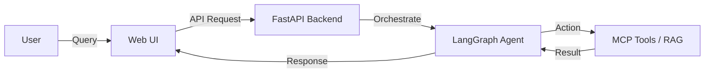
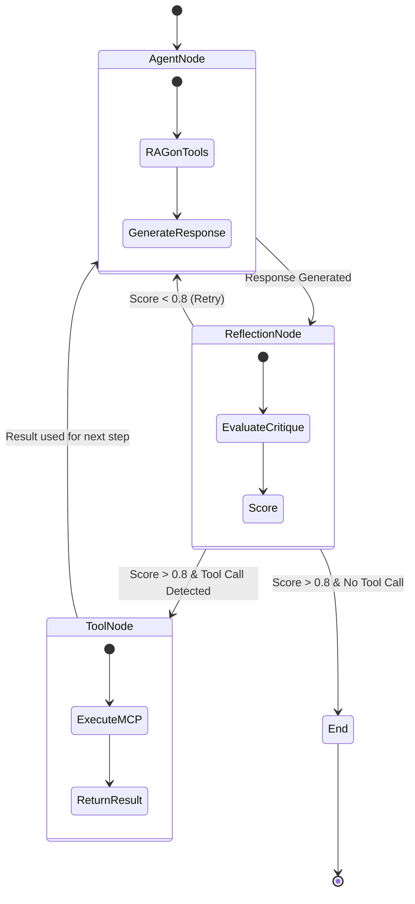

# Forgery AI Agent System 🤖

**A Scalable, Self-Improving Executive AI Agent**


## 🌟 Overview

**Forgery** is a next-generation "Executive Agent" designed to handle complex, multi-step tasks with high reliability. Unlike standard chatbots that drift or hallucinate, Forgery prioritizes **determinism**, **deep contextual memory**, and **self-correction**.

Built on a rigorous architectural blueprint (see `FINAL-RESEARCH.md`), it combines graph-based memory with state-machine orchestration to create an agent that can plan, reflect, and learn.

## 🧠 Core Mechanics

The system architecture relies on four non-negotiable pillars to ensure production-grade reliability:

### 1. Deterministic Orchestration (LangGraph)
We use **LangGraph** to model the agent's brain as a state machine. This allows for:
-   **Cyclic Reasoning**: The agent can loop back to refine its answer if it detects errors.
-   **Checkpoints**: Every step is saved, allowing "Human-in-the-Loop" intervention.
-   **Cost Control**: Prevents infinite loops through strict iteration limits.

### 2. Hybrid Memory (GraphRAG)
Simple vector search isn't enough for complex reasoning. We implement **GraphRAG** by combining:
-   **Neo4j (Graph DB)**: Stores structural relationships (e.g., *Project A -> contains -> Doc B*).
-   **Qdrant (Vector DB)**: Stores semantic embeddings of text chunks.
-   **LlamaIndex**: Orchestrates specific sub-graph traversals to retrieve highly relevant, multi-hop context without polluting the prompts.

### 3. Scalable Tooling (RAG-on-Tools)
To support hundreds of capabilities without overwhelming the LLM's context window, we use a **RAG-on-Tools Router**:
-   **Tool Indexing**: All tools (MCP capabilities) are indexed in a vector database.
-   **Semantic Routing**: The agent retrieves only the top-k (e.g., 5) most relevant tools for the current task.
-   **Efficiency**: Reduces token costs and improves tool selection accuracy.

### 4. Self-Correction (Reflection)
The agent features a built-in "Super-Ego" node:
-   **Critique Phase**: Before showing a result, a separate `ReflectionNode` evaluates the output for hallucinations and completeness.
-   **Refinement Loop**: If the score is low, the agent self-corrects and tries again (up to 3 times).

## 📐 Architecture & Logic Flow

### Simplified Flow


### Detailed Execution Logic


## 🛠️ Tech Stack

| Layer | Component | Description |
| :--- | :--- | :--- |
| **Orchestration** | **LangGraph** | State machine logic and control flow |
| **API Backend** | **FastAPI** | High-performance Python REST API |
| **Graph DB** | **Neo4j** | Knowledge Graph storage |
| **Vector DB** | **Qdrant** | Semantic embedding storage |
| **Frontend** | **Next.js / React** | Dark Glassmorphism UI with real-time WebSocket viz |
| **Observability** | **Langfuse** | Distributed tracing and cost tracking |
| **Multi-Agent** | **CrewAI** | Specialized sub-teams (Research, Analysis) |

## ⚙️ Configuration

Create a `.env` file in the root directory. You can use `.env.example` as a template.

| Variable | Description | Default / Required |
| :--- | :--- | :--- |
| **OPENAI_API_KEY** | Your OpenAI API Key | **Required** |
| **LOG_LEVEL** | Service logging level (DEBUG, INFO, WARNING, ERROR) | `INFO` |
| **QDRANT_URL** | URL for Qdrant Vector DB | `http://qdrant:6333` |
| **NEO4J_URI** | URI for Neo4j Graph DB | `bolt://neo4j:7687` |
| **NEO4J_USERNAME** | Neo4j Username | `neo4j` |
| **NEO4J_PASSWORD** | Neo4j Password | `password` |
| **LANGFUSE_PUBLIC_KEY** | Langfuse Public Key for tracing | Optional |
| **LANGFUSE_SECRET_KEY** | Langfuse Secret Key for tracing | Optional |

## 🚀 Quick Start

### Prerequisites
-   **Docker & Docker Compose**
-   **OpenAI API Key** (Set in `docker-compose.prod.yml` or `.env`)

### Deployment

The entire stack is containerized. Run the production profile to start all services:

```bash
# 1. Clone the repository
git clone https://github.com/brendon92/forgery-ai-agent.git
cd forgery-ai-agent

# 2. Configure Environment
# Ensure Dockerfile exists in root (created in Final Polish)

# 3. Launch Services
docker-compose -f docker-compose.prod.yml up -d --build
```

### Access Points
-   **Frontend Dashboard**: `http://localhost:3000`
-   **Backend API**: `http://localhost:8000/docs`
-   **Neo4j Browser**: `http://localhost:7474`
-   **Langfuse Tracing**: *(Configurable via env)*

## 📂 Project Structure

```
forgery-ai-agent/
├── src/                    # Python Backend
│   ├── agent/              # LangGraph Logic (Nodes, Edges)
│   ├── memory/             # GraphRAG (Neo4j/LlamaIndex)
│   ├── tools/              # RAG-on-Tools Router
│   ├── api/                # FastAPI Routers & WebSockets
│   └── services/           # Background Tasks (Health Monitor)
├── frontend/               # Next.js Frontend
│   ├── app/                # Pages & Layouts
│   └── components/         # Glassmorphism UI Components
├── tests/                  # Unit & Integration Tests
├── Dockerfile              # API Container Definition
└── docker-compose.prod.yml # Production Orchestration
```

## 🔮 Roadmap Status

-   [x] **Phase 1: Foundation** (LangGraph, FastAPI, Setup)
-   [x] **Phase 2: Intelligence** (GraphRAG, Tool Router, Reflection)
-   [x] **Phase 3: Experience** (Real-time Graph Viz via WebSockets, Health Dashboard)
-   [x] **Phase 4: Production** (Docker, Tests, Langfuse, CrewAI)
-   [x] **Phase 5: Management (New)**
    -   **Workspaces**: Multi-tenant graph isolation.
    -   **Agent Personas**: CRUD for defining agent roles and backstories.
    -   **Crew Builder**: Assemble agents into task-specific crews.
    -   **Conversations**: Persistent chat history per workspace.

---
